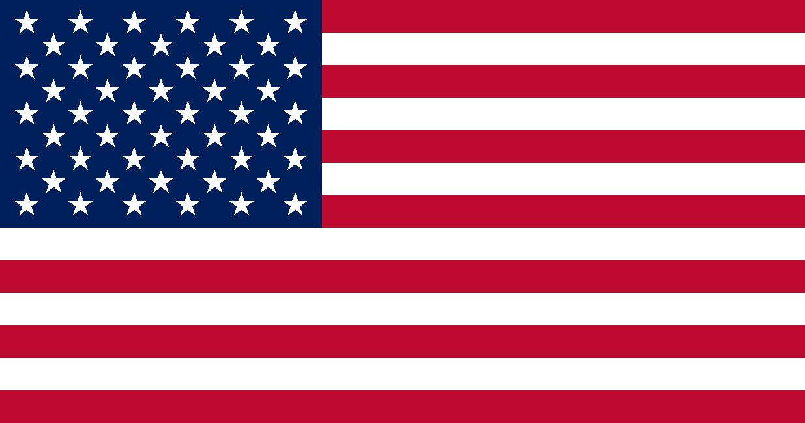

# [The General Welfare Project](https://generalwelfareproject.com)

### 🟥🟥🟥 Know your rights 🟥🟥🟥

### ⬜⬜⬜ Find help ⬜⬜⬜

### 🟦🟦🟦 Call now 🟦🟦🟦

## What is this project

I built a landing page to help underserved Americans access free resources and information. It is optimized for low-end devices and available in multiple languages to reach the people who need it most.

## Optimizing for all Americans

~44 KB per page. 2.3 KB of JS. Zero frameworks. Zero tracking. Off-black background for OLED battery life.

Tested on simulated $150 Android over LTE (70ms RTT, 12 Mbps, 4x CPU slowdown). Lighthouse CI enforces accessibility ≥ 90, FCP < 1,800ms, CLS < 0.1. Playwright enforces per-page transfer < 300 KB, DOM < 1,500 nodes, heap < 10 MB.

Available in English, Spanish, Chinese, Vietnamese, and Filipino.

#

_We the People of the United States, in Order to form a more perfect Union, establish Justice, insure domestic Tranquility, provide for the common defence, promote the **GENERAL WELFARE**, and secure the Blessings of Liberty to ourselves and our Posterity, do ordain and establish this Constitution for the United States of America._
